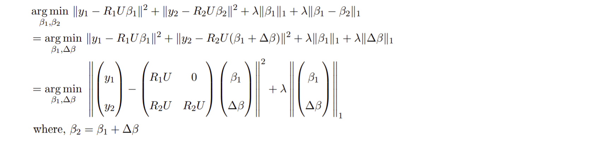

# Compressed Sensing Tomography

In most tomography applications, the number of angles of projection is limited due to cost, energy and health considerations.  
So the problem is of practical interest in the "angle starved" case.  
Hence tomography can be considered a compressed sensing problem.

Filtered Back Projection algorithm which is used for inverse radon transform doesn't exploit the sparsity (or compressibility) of natural images in DCT bases.  
We use this principle to form a cost minimization problem:  

One can make use of additional redundancy in the data – the difference between two consecutive slices is sparse.  
This can be used to improve the tomographic reconstruction quality for the same number of measurements – if one chooses different angles for different slices.  
The cost minimization problem formed for 2 slice Coupled CS:  
  
The cost minimization problem formed for 3 slice Coupled CS:  

