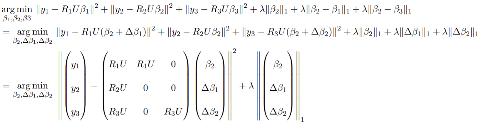

# Compressed Sensing Tomography

Tomography is the task of reconstructing a 2D image (object) from its 1D projections, or a 3D image (object) from its 2D projections.  
We take 18 radon projections of an MRI volume of a brain.  
We reconstruct the MRI slices using Filtered Back Projection (FBP) algorithm using Ram-Lak filter, Compressed Sensing algorithm and slice Coupled Compressed Sensing algorithms.

## CS in Tomography

In most tomography applications, the number of angles of projection is limited due to cost, energy and health considerations.  
So the problem is of practical interest in the "angle starved" case.  
Hence tomography can be considered a compressed sensing problem.

The FBP algorithm which is used for inverse radon transform doesn't exploit the sparsity (or compressibility) of natural images in DCT bases.  
We use this principle (CS) to form a cost minimization problem:  

One can make use of additional redundancy in the data – the difference between two consecutive slices is sparse.  
This can be used to improve the tomographic reconstruction quality for the same number of measurements – if one chooses different angles for different slices.  
The cost minimization problem formed for 2 slice Coupled CS:  
  
The cost minimization problem formed for 3 slice Coupled CS:  

## Code

We have use Object-oriented programming in MATLAB for creating objects needed for `l1_ls` package.  
`@CS` contains class `CS` which represent the forward model matrix for CS tomography.  
`@CCS2` contains class `CCS2` which represent the forward model matrix for 2 slice Coupled CS tomography.  
`@CCS3` contains class `CCS3` which represent the forward model matrix for 3 slice Coupled CS tomography.

Code for FBP algorithm with Ram-Lak filter is present in `fbp.m`.  
Code for CS algorithm is present in `cs1.m`.  
Code for 2 slice Coupled CS algorithm is present in `cs2.m`.  
Code for 3 slice Coupled CS algorithm is present in `cs3.m`.

Execute `fbp.m`, `cs1.m`, `cs2.m` and `cs3.m` in MATLAB to reproduce the results.  
The code is tested on MATLAB 2020b, but should work on other versions of MATLAB with no or little changes.

## Results

We worked on 6 slices present in `data/`.  
FBP and CS Tomography worked on one slice each, whereas 2 slice Coupled CS Tomography and 3 slice Coupled CS Tomography worked on two and three slices respectively.  
We evaluated the reconstructed slices by computing RMSE (Relative Mean Square Error) w.r.t. original slices.
